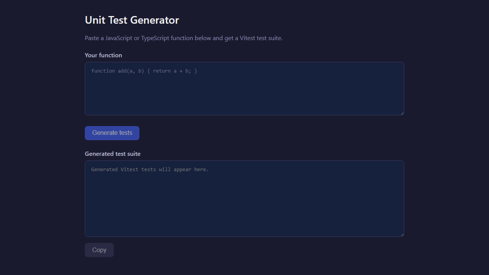

# SEmmn15

Web-Based SE Practice Tool — **Unit Test Generator**.  
Paste one JavaScript/TypeScript function and get a generated Vitest test suite using Gemini.

## Project Overview

- Single-page app (React + Vite frontend, Node.js backend).
- Localhost-only workflow (no deployment required).
- English-only UI and messages.
- Feature LLM is Gemini, called from backend only.

## Installation

1. From project root, run `npm run install:all`.
2. Copy `server/.env.example` to `server/.env`.
3. Set `GEMINI_API_KEY` in `server/.env`.

## Run Locally

- Start backend: `npm run dev:server`
- Start frontend: `npm run dev:client`
- Open: `http://localhost:5173`

## Usage Example

Sample input:

```js
function add(a, b) {
  return a + b;
}
```

Flow:
1. Paste one function into the input area.
2. Click **Generate tests**.
3. Review generated Vitest code in the output area.
4. Click **Copy** to copy the full output.

Screenshot:
- App UI example: `docs/screenshots/usage-example-home.png`



## Phase 1: Requirements Engineering

Phase-1 document: [docs/phase1-requirements-engineering.md](docs/phase1-requirements-engineering.md)

Includes:
- Functional requirements for one-function input, validation, generation, and copy flow.
- Acceptance criteria for UI behavior, backend validation, and output/error handling.

Coding LLM chat artifacts:
- [chats/phase1-coding-llm.txt](chats/phase1-coding-llm.txt) - Prompt used to generate the phase-1 requirements and acceptance criteria structure.

## Phase 2: Architecture

Phase-2 document: [docs/phase2-architecture.md](docs/phase2-architecture.md)

Includes:
- Overall architecture and technology stack.
- Frontend/backend responsibility split.
- Gemini integration model and end-to-end data flow.
- Proposed file structure and third-party libraries.

Coding LLM chat artifacts:
- [chats/phase2-coding-llm.txt](chats/phase2-coding-llm.txt) - Prompt used to produce architecture decisions and sectioned documentation.

## Phase 3: Coding & Testing

Coding LLM chat artifacts:
- [chats/phase3-coding-llm.txt](chats/phase3-coding-llm.txt) - Prompt used to guide implementation and test-task breakdown.

### Key Files

| File Name | Description |
|-----------|-------------|
| [server/index.js](server/index.js) | Express app entry point; CORS, JSON parser, and `POST /api/generate-tests` route registration. |
| [server/routes/generateTests.js](server/routes/generateTests.js) | Request handler with input validation, service call, and API response mapping. |
| [server/services/geminiService.js](server/services/geminiService.js) | Gemini API integration and prompt construction. |
| [server/utils/validation.js](server/utils/validation.js) | JavaScript/TypeScript syntax validation and single-function input enforcement. |
| [server/.env.example](server/.env.example) | Example environment configuration (`GEMINI_API_KEY`, `GEMINI_MODEL`, `PORT`). |
| [client/src/App.jsx](client/src/App.jsx) | Main single-page UI flow: input, generate action, loading state, output, and copy action. |
| [client/src/api/generateTests.js](client/src/api/generateTests.js) | Frontend API client for `POST /api/generate-tests`. |
| [client/src/components/CodeInput.jsx](client/src/components/CodeInput.jsx) | Input area for pasting one function. |
| [client/src/components/GenerateButton.jsx](client/src/components/GenerateButton.jsx) | Generate action button with loading label/state. |
| [client/src/components/TestOutput.jsx](client/src/components/TestOutput.jsx) | Read-only output area for generated tests or error text. |
| [client/src/components/CopyButton.jsx](client/src/components/CopyButton.jsx) | Copy-to-clipboard button for generated output. |
| [playwright.config.js](playwright.config.js) | Playwright configuration for E2E execution. |
| [e2e/generate-tests.spec.js](e2e/generate-tests.spec.js) | Meaningful system test for a full user flow. |

### System Test

- Test link: [e2e/generate-tests.spec.js](e2e/generate-tests.spec.js)
- What is tested: user can open app, paste function, generate tests, and see output.
- Why meaningful: validates end-to-end integration (UI + API + backend + LLM response path).
